## robotics_papers

${\LaTeX}$ Template: `neurips_2023`

[Template](https://github.com/nicewang/robotics_papers/actions/runs/21002896691/artifacts/5129631517)
- [ ] Move to a valid position.

### Journal

#### TRO
IEEE Transactions on Robotics
##### 2024
- [FlowMPC: Learning a Generalizable Trajectory Sampling Distribution for Model Predictive Control](journal/TRO/24/FlowMPC)
    - Exp:
        - [ ] Real-world Robotics Exp.
        - [ ] Simulation
        - [ ] Other Application Scenarios (but within the scope of control & robotics)
    - Confidence: ([details](journal/TRO/24/FlowMPC/.confidence/))
- [Port-Hamiltonian ODE: Port-Hamiltonian Neural ODE Networks on Lie Groups for Robot Dynamics Learning and Control](journal/TRO/24/Port-Hamiltonian-ODE/)
    - Exp:
        - [x] Real-world Robotics Exp.
            - PX4 quadrotors (RaspberryPi)
        - [x] Simulation
        - [ ] Other Application Scenarios (but within the scope of control & robotics)
    - Confidence: _35% ~ 40% ([details](journal/TRO/24/Port-Hamiltonian-ODE/.confidence/))

### Conf

#### CoRL
Conference on Robot Learning. PMLR.
##### 2021
- [Meshing Box: Explicitly Encouraging Low Fractional Dimensional Trajectories via Reinforcement Learning](conf/corl/21/meshing_box/)
    - Exp:
        - [ ] Real-world Robotics Exp.
        - [ ] Simulation
        - [ ] Other Application Scenarios (but within the scope of control & robotics)
    - Confidence: ([details](conf/corl/21/meshing_box/.confidence/))

#### HRI
ACM/IEEE International Conference on Human-Robot Interaction
##### 2025
- [CLEA: Contrastive Learning from Exploratory Actions: Leveraging Natural Interactions for Preference Elicitation](conf/HRI/25/CLEA)
    - Exp:
        - [ ] Real-world Robotics Exp.
        - [ ] Simulation
        - [ ] Other Application Scenarios (but within the scope of control & robotics)
    - Confidence: ([details](conf/HRI/25/CLEA/.confidence/))

#### ICRA
IEEE International Conference on Robotics
##### 2024
- [A GP-based Robust Motion Planning Framework for Agile Autonomous Robot Navigation and Recovery in Unknown Environments](conf/icra/24/gp_based_motion_planing_frame_4_navi_recov_in_unknown_envs)
    - Exp:
        - [ ] Real-world Robotics Exp.
        - [ ] Simulation
        - [ ] Other Application Scenarios (but within the scope of control & robotics)
    - Confidence: ([details](conf/icra/24/gp_based_motion_planing_frame_4_navi_recov_in_unknown_envs/.confidence/))

##### 2025
- [BoxMap: Efficient Structural Mapping and Navigation](conf/icra/25/boxmap)
    - Exp:
        - [ ] Real-world Robotics Exp.
        - [ ] Simulation
        - [ ] Other Application Scenarios (but within the scope of control & robotics)
    - Confidence: ([details](conf/icra/25/boxmap/.confidence/))

##### 2026
- [CLF-RL: Chasing Stability: Humanoid Running via Control Lyapunov Function Guided Reinforcement Learning](conf/icra/26/CLF-RL)
    - Exp:
        - [ ] Real-world Robotics Exp.
        - [ ] Simulation
        - [ ] Other Application Scenarios (but within the scope of control & robotics)
    - Confidence: ([details](conf/icra/26/CLF-RL/.confidence/))

#### L4DC
Learning for Dynamics \& Control Conference

##### 2025
- [Boltzmann Learning: Learning with Contextual Information in Non-Stationary Environments](conf/L4DC/25/boltzmann_learning_based_control/)
    - Exp:
        - [ ] Real-world Robotics Exp.
        - [ ] Simulation
        - [ ] Other Application Scenarios (but within the scope of control & robotics)
    - Confidence: ([details](conf/L4DC/25/boltzmann_learning_based_control/.confidence/))
