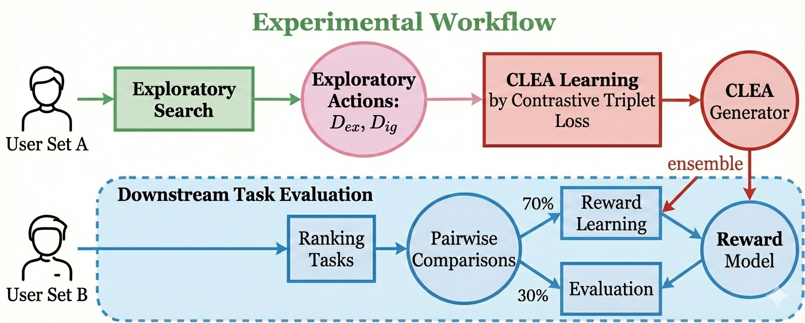

### CLEA: Contrastive Learning from Exploratory Actions: Leveraging Natural Interactions for Preference Elicitation
This document summarizes the core contributions and methodology of the paper "Contrastive Learning from Exploratory Actions: Leveraging Natural Interactions for Preference Elicitation", focusing on its' main ideas and the core blocks.
- [Original Paper](https://github.com/nicewang/robotics_papers/tree/assets/conf/hri/25/clea/original_paper)
- Summarization Download: TBD

#### Summarized Block-Diagram
 

#### Orig Paper Citation
```BibTex
@inproceedings{mohammad2024gp,
@inproceedings{dennler2025contrastive,
  title={Contrastive Learning from Exploratory Actions: Leveraging Natural Interactions for Preference Elicitation},
  author={Dennler, Nathaniel and Nikolaidis, Stefanos and Matari{\'c}, Maja},
  booktitle={2025 20th ACM/IEEE International Conference on Human-Robot Interaction (HRI)},
  pages={778--788},
  year={2025},
  organization={IEEE}
}
```