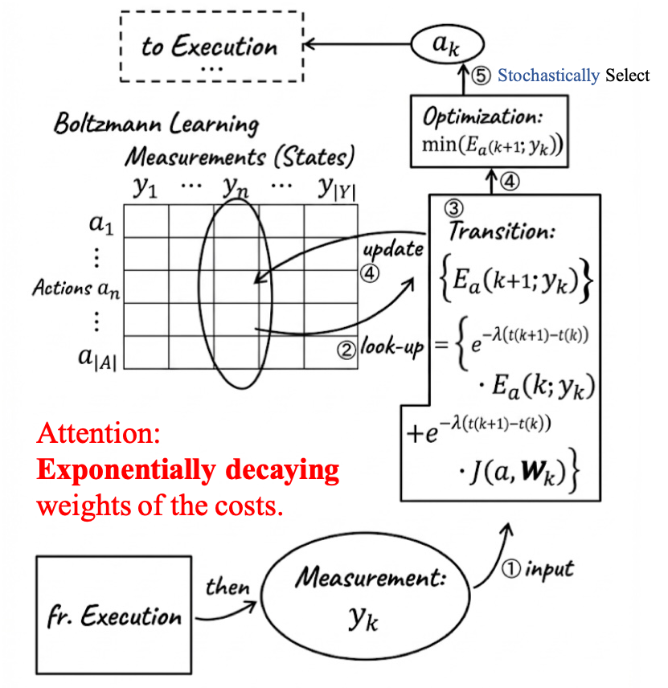

## Boltzmann Learning based Control: 
### Learning with Contextual Information in Non-Stationary Environments
This document summarizes the core contributions and methodology of the paper "Learning with Contextual Information in Non-Stationary Environments", focusing on its' main ideas and the core blocks.
- [Original Paper](https://github.com/nicewang/robotics_papers/tree/assets/conf/L4DC/25/boltzmann_learning_based_control/original_paper)
- Summarization Download: TBD

#### Summarized Block-Diagram

> [!Caution]
> 
> **Is this the correct one?** It seems that **the updating (learning) should take place after the execution**, otherwise _the cost of current iteration is unknown_. The correct order of each iteration seems should be: Perception -> Decision Making -> Act -> Feedback -> Learn. (See [Issue#86](https://github.com/nicewang/robotics_papers/issues/86)). But need to be confirmed ([@nicewang](https://github.com/nicewang)).
>

 

#### Orig Paper Citation
```BibTex
@inproceedings{anderson2025learning,
  title={Learning with contextual information in non-stationary environments},
  author={Anderson, Sean and Hespanha, Joao P},
  year={2025},
  organization={7th Annual Learning for Dynamics \& Control Conference (L4DC 2025~…}
}
```
