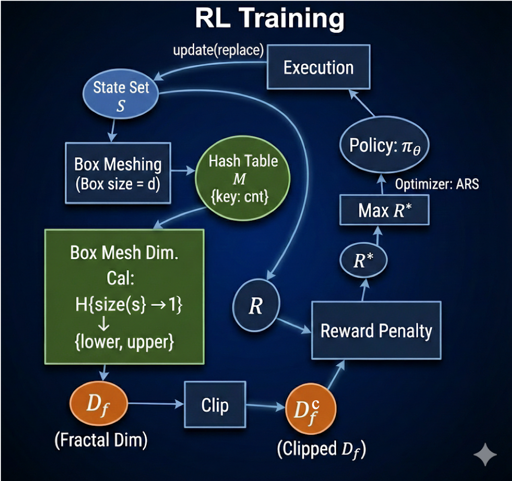
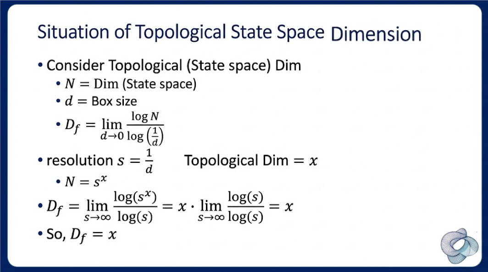
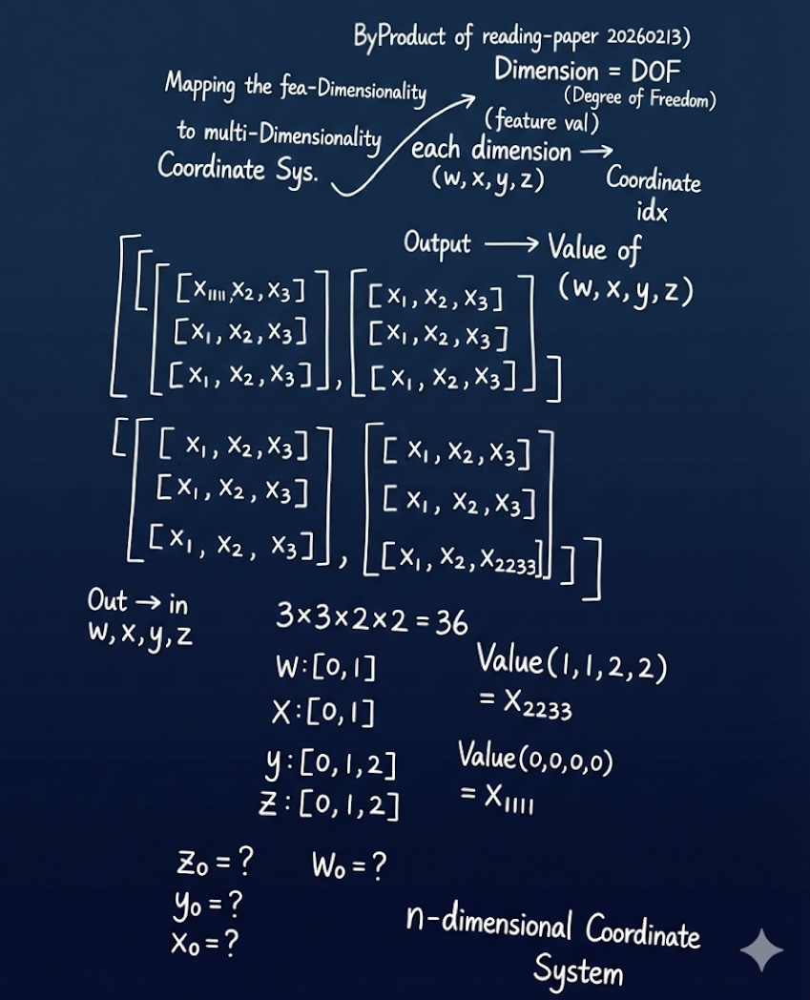

## Meshing-Box: 
### Explicitly Encouraging Low Fractional Dimensional Trajectories via Reinforcement Learning
This document summarizes the core contributions and methodology of the paper "Explicitly Encouraging Low Fractional Dimensional Trajectories via Reinforcement Learning", focusing on its' main ideas and the core blocks.
- [Original Paper](https://github.com/nicewang/robotics_papers/tree/assets/conf/corl/21/meshing_box/original_paper)
- Summarization Download: TBD

#### Comments

> [!Note]
> 
> **Disclaimer:** Opnions are Xiaonan (Nice) Wang's Own. It represents a personal interpretation and may contain inaccuracies. Feedback or corrections via email are highly welcomed.
>

#### Summarized Block-Diagram
 

#### Orig Paper Citation
```BibTex
@inproceedings{gillen2021explicitly,
  title={Explicitly encouraging low fractional dimensional trajectories via reinforcement learning},
  author={Gillen, Sean and Byl, Katie},
  booktitle={Conference on Robot Learning},
  pages={2137--2147},
  year={2021},
  organization={PMLR}
}
```

### Appendix

#### Formula Derivation

When considering about topological dim., Eq. 1 equals to topological dim.



#### Note Draft

Mapping the Fea-Dimensionality to Multi-Dimensionality Coordinate Sys.



#### Physical DOF vs. Feature Dimension vs. Fractal Dimension

| Concept | Explanation | Metaphor | Attribute |
| :--- | :--- | :--- | :--- |
| **Physical DOF** | Degrees of Freedom | The number of **joints** in the robot (hardware constraint). | Constant |
| **Feature Dimension** | State Space Dimension | The **total number of coordinate axes** describing the motion (typically $le 2 \times$ DOF: e.g. for each joint, $<q, \dot{q}>$ whereas ${q}$ is the position and $\dot{q}$ is the velocity). | Constant |
| **Fractal Dimension** | Fractal Dimension ($D_f$) | The **"thickness" or complexity** of the actual trajectory the robot follows. | **Variable** (Determined by RL policy, _theoretical maximum is State Space Dimension_) |
