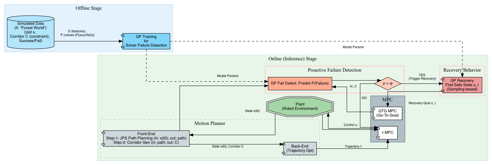

### A GP-based Robust Motion Planning Framework for Agile Autonomous Robot Navigation and Recovery in Unknown Environments
This document summarizes the core contributions and methodology of the paper "A GP-based Robust Motion Planning Framework for Agile Autonomous Robot Navigation and Recovery in Unknown Environments", focusing on its' main ideas and the core blocks.
- [Original Paper](https://github.com/nicewang/robotics_papers/tree/assets/conf/icra/24/gp_based_motion_planing_frame_4_navi_recov_in_unknown_envs/original_paper)
- Summarization Download: TBD

#### Summarized Block-Diagram
 

#### Orig Paper Citation
```BibTex
@inproceedings{mohammad2024gp,
  title={A gp-based robust motion planning framework for agile autonomous robot navigation and recovery in unknown environments},
  author={Mohammad, Nicholas and Higgins, Jacob and Bezzo, Nicola},
  booktitle={2024 IEEE International Conference on Robotics and Automation (ICRA)},
  pages={2418--2424},
  year={2024},
  organization={IEEE}
}
```