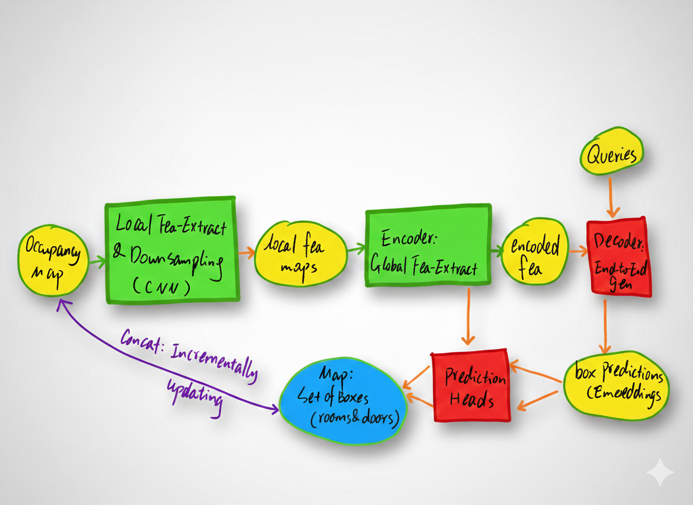

### BoxMap: Efficient Structural Mapping and Navigation
This document summarizes the core contributions and methodology of the paper "BoxMap: Efficient Structural Mapping and Navigation", focusing on its' main ideas and the core blocks.
- [Original Paper](https://github.com/nicewang/robotics_papers/tree/assets/conf/icra/25/boxmap/original_paper)
- Summarization Download: TBD

### Shortages
- The architecture feels like a *patchwork* of existing methods.
  - "A + B + C for Task D"
- The technical novelty is *incremental and thin*.
- Several descriptions are *misattributed or conceptually confused*.
  - e.g. In paper, it claims that "TSDF" L2 loss leads to non manual labeling;
  ```
  "We use losses based on the Truncated Signed Distance Function (TSDF) of predicted boxes to learn against the ground truth TSDF. Compared to losses based on vertices, our method is easier to train and avoids the necessity of manual labelling."
  ```
  - Actually, it's BoxMap which leads to this effect.
- *Buzzword-Chasing*

#### Summarized Block-Diagram
 

#### Other Summarized Details
| Component | Input | Primary Function | Core Logic and Value |
| :--- | :--- | :--- | :--- |
| CNN Backbone | Occupancy *Map* ($fr.$ TSDF) | Dimensionality Reduction and Local Feature Extraction | (1) **Downsamples** inputs into lower-resolution semantic feature maps.  <br>(2) Reduces pixel count to prevent $O(N^2)$ complexity explosion in Attention. <br>(3) Provides **Inductive Bias** (Translation Invariance).</br> |
| Transformer Encoder | Feature Maps | Global Context Encoding | Uses **Self-attention** to model long-range dependencies between pixels (e.g., relating distant walls). |
| Object Queries | Learnable Vectors | Entity Proposals | Acts as $M$ placeholders (occupants) to query potential objects in the scene. |
| Transformer Decoder | Queries + Encoded Features (via **Cross-attention**) | Object Manifestation | Maps queries to specific $M$ **Box Embeddings**. |
| Decoder Self-Attention | Intermediate Queries | Parallel Coordination | Unmasked Attention allows queries to communicate and avoid redundant detections (Parallel de-duplication). |
| Hierarchical Loss | Predicted Boxes vs. GT | Detail Enhancement | Subtracts large objects (rooms) from TSDF to focus on small topological details (doors). |
| Prediction Heads | Box Embeddings | Geometric *Mapping* | Projects embeddings into box coordinates and class labels (specifying existence). |

#### Orig Paper Citation
```BibTex
@inproceedings{mohammad2024gp,
@inproceedings{wang2025boxmap,
  title={Boxmap: Efficient structural mapping and navigation},
  author={Wang, Zili and Allum, Christopher and Andersson, Sean B and Tron, Roberto},
  booktitle={2025 IEEE International Conference on Robotics and Automation (ICRA)},
  pages={6401--6407},
  year={2025},
  organization={IEEE}
}
```
