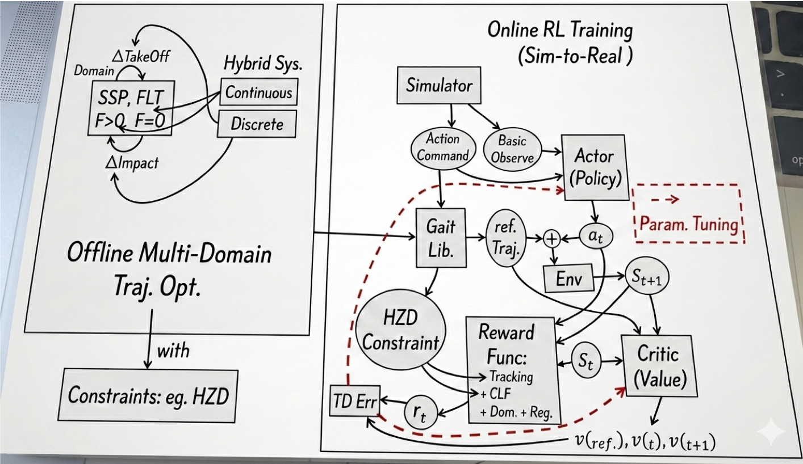

## CLF-RL: 
### Chasing Stability: Humanoid Running via Control Lyapunov Function Guided Reinforcement Learning
This document summarizes the core contributions and methodology of the paper "Chasing Stability: Humanoid Running via Control Lyapunov Function Guided Reinforcement Learning", focusing on its' main ideas and the core blocks.
- [Original Paper](https://github.com/nicewang/robotics_papers/tree/assets/conf/icra/26/CLF-RL/original_paper)
- Summarization Download: TBD

#### Summarized Block-Diagram
 

#### Orig Paper Citation
```BibTex
@article{olkin2025chasing,
  title={Chasing Stability: Humanoid Running via Control Lyapunov Function Guided Reinforcement Learning},
  author={Olkin, Zachary and Li, Kejun and Compton, William D and Ames, Aaron D},
  journal={arXiv preprint arXiv:2509.19573},
  year={2025}
}
```

#### Appendix: Some Notes
- "Each *joint* or *end effector* is modeled using a *reduced-order* double-integrator system, which allows the use of a quadratic CLF (Eq. 12, Convexity)"
- "a common practice that helps prevent *overfitting* to the simulator and improves robustness by **exposing** the policy to a wide variety of states that could arise from *model mismatches in the real world*."
- "*Full-order* dynamic reference trajectories are generated offline using a multi-domain trajectory optimizer."
