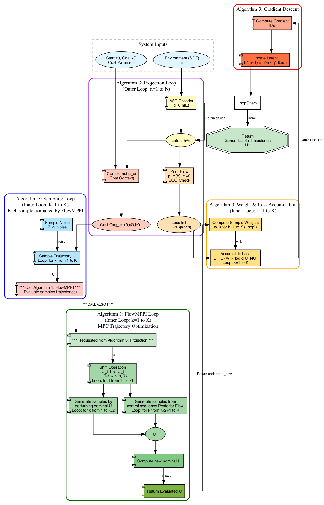

### Learning a Generalizable Trajectory Sampling Distribution for Model Predictive Control

This document summarizes the core contributions and methodology of the paper "Learning a Generalizable Trajectory Sampling Distribution for Model Predictive Control," focusing on its' main ideas and the core blocks.
- [Original Paper](https://github.com/nicewang/robotics_papers/tree/assets/journal/TRO/24/learning_a_generalizable_trajectory_sampling_distrib_4_mpc/original_paper)
- [Summarization Download](https://github.com/nicewang/robotics_papers/actions/runs/21201627780/artifacts/5200920072)

#### Summarized-Blockdiagram
 

#### Paper Citation
```BibTex
@article{power2024learning,
  title={Learning a generalizable trajectory sampling distribution for model predictive control},
  author={Power, Thomas and Berenson, Dmitry},
  journal={IEEE Transactions on Robotics},
  volume={40},
  pages={2111--2127},
  year={2024},
  publisher={IEEE}
}
```